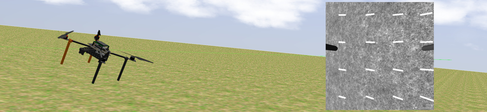

# Optical Flow Odometry



| Build status | [](https://github.com/ctu-mrs/mrs_optic_flow/actions) |
|--------------|--------------------------------------------------------------------------------------------------------------------------------------------|

## Description

* Optical flow is the simplest solution for getting a velocity measurement of a UAV (robot) using only onboard sensors,
* can be used both indoors and outdoors,
* can be used as a backup for other more complicated systems that are more likely to fail.

## System requirements

* A calibrated downwards-facing camera
  * we use mvBlueFOX cameras with ~90 degrees of vertical FOV
* A source of *height* (distance to the ground), *orientation* (tilt), and *angular rate*
* Either a GPU (Integrated is often sufficient) or a decent CPU.

## Troubleshooting

### General points

* Make sure that the `gui` parameter is set to false if you are running this on a UAV, as the missing access to a display server will lead to crash otherwise.
* A correct camera TF is vital for a proper function of the Optic flow.
* Make sure that the lens is appropriate for the intended flight heights and speeds.
* A narrower angle of view is more suitable for high flights, as these provide better precision, while for flying close to the ground, you should opt for a wide-angle lens to increase the maximum measurable speeds.
* The lens distortion typically makes the maximum speed smaller for edges of the image, but usually, this will be accounted for by the multi-point processing.

### GPU-accelerated processing

The acceleration is implemented in the OpenCL framework.
Regardless of your GPU, install packages:
```bash
sudo apt -y install ocl-icd-dev ocl-icd-libopencl1 ocl-icd-opencl-dev opencl-headers clinfo
```

### Intel GPUs

For generations greater than 8th (Broadwell) you have to install the NEO OpenCL drivers:
https://github.com/intel/compute-runtime/releases
For latest version at the time of writing, use:
```bash
cd /tmp
mkdir -p neo
cd neo
wget https://github.com/intel/compute-runtime/releases/download/20.16.16582/intel-gmmlib_20.1.1_amd64.deb
wget https://github.com/intel/compute-runtime/releases/download/20.16.16582/intel-igc-core_1.0.3826_amd64.deb
wget https://github.com/intel/compute-runtime/releases/download/20.16.16582/intel-igc-opencl_1.0.3826_amd64.deb
wget https://github.com/intel/compute-runtime/releases/download/20.16.16582/intel-opencl_20.16.16582_amd64.deb
wget https://github.com/intel/compute-runtime/releases/download/20.16.16582/intel-ocloc_20.16.16582_amd64.deb
sudo dpkg -i *.deb
```

For older (3rd to 6th gen) you have to install the Beignet OpenCL drivers:
```bash
sudo apt -y install beignet
```

For generations in between, either may or may not work, try it starting with NEO drivers.

## Setting up lightdm (mandatory)

Make sure that lightdm is the default login manager. Choose option "lightdm" while running:
```bash
sudo dpkg-reconfigure lightdm
```

The lightdm has to be started for the GPU to show as a OpenCL device.
For this to be the case, include in `/etc/lightdm/` a file `lightdm.conf`, with the contents:
```
[SeatDefaults]
autologin-user=mrs
autologin-user-timeout=0
```
Replace username `mrs` with your username.

In newer releases of Ubuntu, it may be necessary to remove `unity-greeter`, which prevents the autologin.

Additionally, if these steps were not sufficient, check if the headless video is enabled (or available) in BIOS.

### Nvidia GPUs

Processing a single piece of data on an external GPU is faster, but the transfer of data into and from these devices creates a significant overhead, which typically leads to the integrated GPU providing a better output rate.
In integrated GPUs the data is being copied to a different area in the same RAM, whereas in a discrete GPU it is copied over the PCI into the GDDR.
This is even worse if the GPU is connected via Thunderbolt.
With new devices, don't assume that one GPU works better, but rather test this empirically.

Also, install packages:
```
nvidia-libopencl1-XXX [nvidia-libopencl1-XXX-updates] nvidia-opencl-icd-XXX nvidia-opencl-dev
```
where XXX is your Nvidia driver version.

In some cases, you may also have to install CUDA Toolkit.

## CPU

If you can't get any GPU to cooperate, enable the CPU processing by passing the parameter useOCL in the launch file as `false`.
This will work everywhere, but the output rate may be less than satisfactory.
Set flight control to appropriate speeds, as the lower rate leads to stricter limits on the maximum measurable speeds - the shift during a longer period may move the ground image out of matching range.
